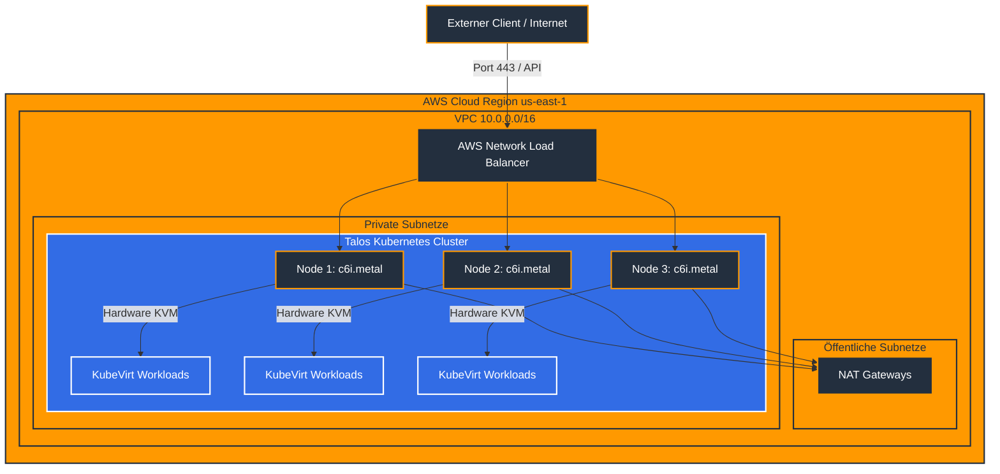

# README: Talos Linux auf AWS mit Nested Virtualization

### Projektübersicht
Dieses Repository enthält die deklarative Infrastruktur-als-Code-Definition zur Bereitstellung eines hochverfügbaren Talos-Linux-Clusters auf Amazon Web Services. Der technologische Kernfokus dieses Deployments liegt auf der Aktivierung der hardwarebeschleunigten verschachtelten Virtualisierung auf Kernel-Ebene, um den performanten Betrieb von Virtual-Machine-Workloads über Operatoren wie KubeVirt zu gewährleisten. Die gesamte Orchestrierung wird durch Terraform gesteuert, wobei das offizielle Isovalent-Modul für Talos auf AWS zum Einsatz kommt. Dieses Modul abstrahiert den manuellen Bootstrapping-Prozess vollständig und übersetzt die komplexe Talos-Konfiguration nativ in AWS-Ressourcen.

### Architektur
Die physische Grundlage des Clusters bilden dedizierte Bare-Metal-Instanzen der Klasse `c6i.metal`. Diese Architekturentscheidung ist zwingend erforderlich, da der AWS-Nitro-Hypervisor bei herkömmlichen virtualisierten EC2-Instanzen die essenziellen VMX-CPU-Erweiterungen herausfiltert, wodurch KubeVirt auf ineffiziente Software-Emulation zurückfallen würde. Das Architekturdesign verzichtet bewusst auf dedizierte Worker-Knoten und nutzt stattdessen ein reines Control-Plane-Cluster, bestehend aus drei Knoten, welche durch gezielte Patches als vollwertige Worker für Workloads autorisiert sind. Die Integration in das externe Netzwerk wird durch den AWS Cloud Controller Manager sichergestellt, welcher Ingress-Dienste dynamisch mit nativen AWS Elastic Load Balancern verknüpft.

### Konfiguration und Bereitstellung
Die Authentifizierung gegenüber der AWS-API erfolgt zentral und sicher über eine in der Datei `~/.aws/config` definierte `sso-session`, welche via `aws sso login` vor der Terraform-Ausführung initialisiert wird. Die Codebasis ist streng logisch getrennt. Die Datei `variables.tf` deklariert die Schnittstellen, während die `terraform.tfvars` die spezifischen Parameter wie die Netzwerkkonfiguration über drei getrennte Availability Zones einsteuert. Innerhalb der `main.tf` wird das VPC-Modul provisioniert, wobei den Subnetzen zwingend die spezifischen Routing-Tags für den Load Balancer sowie interne Markierungen für das Talos-Modul zugewiesen werden. Die Injektion der Kernel-Module für Intels verschachtelte Virtualisierung erfolgt über die ausgelagerte Datei `kvm-patch.yaml`, welche als Referenzpfad an das Isovalent-Modul übergeben wird. Nach der erfolgreichen Ausführung von `terraform apply` generiert das Modul die `talosconfig` sowie die `kubeconfig` lokal im State. Diese können über die definierten Terraform-Outputs in physische Dateien extrahiert werden, um den sofortigen administrativen Zugriff via `talosctl` und `kubectl` zu ermöglichen.

### Häufig gestellte Fragen (FAQ)

**Warum werden Bare-Metal-Instanzen anstelle der m8i-Serie verwendet?**
AWS filtert die für die Hardware-Virtualisierung notwendigen CPU-Flags bei allen standardmäßigen virtuellen Maschinen rigoros heraus. Für einen produktionsreifen KubeVirt-Betrieb ist der direkte Hardwarezugriff unumgänglich, weshalb die Nutzung der `.metal`-Instanztypen die einzig funktionale Lösung auf dieser Cloud-Plattform darstellt.

**Warum wird die worker_groups-Variable als leeres Array definiert?**
Um eine effiziente und ressourcenschonende Architektur zu etablieren, wird das Cluster ausschließlich aus drei Control-Plane-Knoten gebildet. Durch die Deaktivierung der Taints auf der Control Plane übernehmen diese Knoten die doppelte Rolle aus Cluster-Management und Workload-Verarbeitung, wodurch separate, kostenintensive Worker-Instanzen obsolet werden. Das leere Array `[]` teilt dem Modul technisch korrekt mit, dass keine Worker-Provisionierung erwünscht ist.

**Welche Funktion erfüllt der AWS Load Balancer in diesem isolierten Setup?**
Da die Talos-Knoten aus Sicherheitsgründen in rein privaten Subnetzen ohne öffentliche IP-Adressen platziert werden, fungiert der durch den AWS Cloud Controller provisionierte Load Balancer als zwingend notwendiges API-Gateway. Er empfängt den externen Datenverkehr in den öffentlichen Subnetzen und routet diesen zuverlässig über die privaten IP-Adressen an die NodePorts der Kubernetes-Dienste im Cluster.

### Troubleshooting und Fehlerbehebung

Ein Stagnieren des Terraform-Deployments bei der Ausführung des `wait-for-subnets.sh`-Skripts deutet immer auf eine fehlerhafte Tag-Konfiguration im VPC-Modul hin. Das Isovalent-Modul sucht zur Gewährleistung der Hochverfügbarkeit nach exakt drei Subnetzen, welche das Tag `type="public"` für externe Ressourcen und `type="private"` für die Knoten tragen müssen. Werden diese Tags korrigiert, setzt das Skript den Vorgang sofort fort.

Sollten die Knoten nach dem erfolgreichen Start dauerhaft im Status `NotReady` verbleiben, hat Kubernetes keine Berechtigung, mit der AWS-API zu kommunizieren. Dieses Problem wird behoben, indem das Argument `deploy_external_cloud_provider_iam_policies = true` im Talos-Modulblock aktiviert wird. Hierdurch generiert Terraform die notwendigen IAM-Rollen, mit denen der Cloud Controller Manager die Instanzen im Cluster validieren kann.

Ein direkter Abbruch während der Terraform-Validierungsphase mit Hinweisen auf fehlerhafte `config_patches` resultiert aus einer inkompatiblen Struktur der YAML-Patch-Datei. Das Isovalent-Modul übernimmt die Konfiguration der Cluster-Rollen autonom. Die referenzierte Patch-Datei darf daher keine Scheduling-Parameter auf Cluster-Ebene enthalten, sondern muss sich strikt auf den Block `machine` beschränken. In diesem Block müssen die KVM-Kernel-Module, die Parameter `nested=1` sowie `ept=1` und das modifizierte Kubernetes-Worker-Label definiert werden, um von der strengen API-Prüfung des Talos-Providers akzeptiert zu werden.
