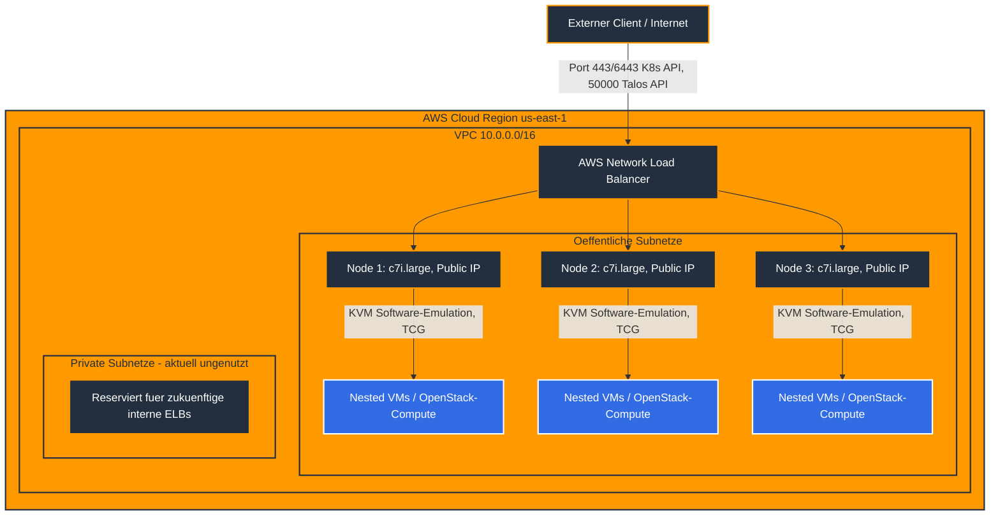

# README: Talos Linux auf AWS mit Nested Virtualization

### Projektübersicht
Dieses Repository enthält die deklarative Infrastruktur-als-Code-Definition zur Bereitstellung eines Talos-Linux-Clusters auf Amazon Web Services. Der technologische Kernfokus dieses Deployments liegt auf der Aktivierung der hardwarebeschleunigten verschachtelten Virtualisierung auf Kernel-Ebene, um darauf perspektivisch OpenStack (via Yaook) oder KubeVirt-Workloads zu betreiben. Die Orchestrierung wird durch Terraform gesteuert, wobei das Community-Modul [isovalent/terraform-aws-talos](https://github.com/isovalent/terraform-aws-talos) für Talos auf AWS zum Einsatz kommt. Dieses Modul abstrahiert den manuellen Bootstrapping-Prozess weitgehend und übersetzt die Talos-Konfiguration in AWS-Ressourcen — es installiert allerdings **kein CNI und keinen Cloud-Controller automatisch fertig konfiguriert**, siehe Abschnitt "Bereitstellung" unten.

> Dieses Setup ist ein Lern-/Experimentier-Projekt, kein produktionsreifes Referenzdesign. Die folgenden Abschnitte beschreiben bewusst auch die Ecken und Kanten, die beim Testen aufgefallen sind.

### Architektur
Die Control-Plane-Knoten laufen auf virtualisierten Nitro-Instanzen der Klasse `c7i.large` — **bewusst keine Bare-Metal-Instanz** (`*.metal`). Bare-Metal-Instanzen unterstützen auf AWS kategorisch kein UEFI-Boot (nur Legacy BIOS), die offizielle Talos-AMI ist aber strikt mit `boot_mode = uefi` registriert. Ein erster Versuch mit `c6i.metal` schlug deshalb beim `terraform apply` mit `InvalidParameterValue: ... does not support an AMI with a boot mode of UEFI` fehl — das ist kein Einzelfall dieses Instanztyps, sondern gilt für jede `.metal`-Instanz auf AWS.

Aktueller Stand von Nested Virtualization: `kvm-patch.yaml` lädt die Kernel-Module `kvm`/`kvm_intel` mit `nested=1`/`ept=1`, aber ohne Hardware-VMX-Passthrough läuft KVM auf `c7i.large` per Software-Emulation (TCG) — funktional für erste Tests des Talos/Kubernetes/Yaook-Stacks, aber spürbar langsamer als echte Hardware-Virtualisierung. AWS unterstützt seit Februar 2026 echte Nested Virtualization auf virtualisierten Instanzen (`c7i`/`m7i`/`r7i`/`c8i`/`m8i`/`r8i` u.a.) über die CPU-Option `cpu_options.nested_virtualization = enabled`. Das verwendete Terraform-Modul reicht diese Option für seine `control_plane`/`worker_groups`-Instanzen aktuell nicht durch (siehe Befund 1) — das ist der nächste sinnvolle Ausbauschritt (Modul-Fork), sobald der Rest des Stacks (Kubernetes, Cilium, CCM, Yaook) steht. `c7i` wurde deshalb bewusst statt eines beliebigen anderen Nitro-Typs gewählt, weil die Familie bereits zu den für diese CPU-Option unterstützten Typen gehört.

Das Architekturdesign verzichtet bewusst auf dedizierte Worker-Knoten und nutzt stattdessen ein reines Control-Plane-Cluster (`worker_groups = []`), bestehend aus mehreren Knoten, welche durch `allow_workload_on_cp_nodes = true` als vollwertige Worker für Workloads autorisiert sind.

**Tatsächliche Netzwerktopologie (wichtig, weicht vom ursprünglichen Diagramm ab — siehe Befund 4):** Alle Talos-Knoten laufen in den **öffentlichen** Subnetzen mit **öffentlicher IP-Adresse**. Das ist keine Fehlkonfiguration, sondern eine dokumentierte Voraussetzung des `isovalent/terraform-aws-talos`-Moduls: Der Talos-Terraform-Provider spricht während Bootstrap und Configuration-Apply direkt über die öffentliche IP mit der Talos-API (Port 50000) jeder Instanz. Die privaten Subnetze werden aktuell von keiner Ressource genutzt (siehe Befund 5) und existieren nur als Grundlage für spätere interne Load Balancer.




### Bereitstellung (Schritt für Schritt)

1. **AWS-Authentifizierung**: über eine in `~/.aws/config` definierte `sso-session`, initialisiert via `aws sso login`.
2. **`terraform.tfvars` prüfen, bevor `terraform apply` läuft:**
   - `control_plane_count` ggf. auf `1` reduzieren, siehe Kostenhinweis unten.
   - **`external_source_cidrs` zwingend einschränken** (Standardwert ist `0.0.0.0/0` = Kubernetes- und Talos-API weltweit erreichbar, siehe Befund 6). Eigene IP ermitteln mit `curl -4 ifconfig.me` und als `"<IP>/32"` eintragen.
3. `terraform init && terraform apply`. Das Modul erzeugt VPC, NLB, Security Groups, die EC2-Instanzen, bootstrapped Talos und schreibt `talosconfig`/`kubeconfig` lokal unter `.terraform/.workspace-*/`.
4. **Cilium installieren (Pflichtschritt, siehe Befund 3):** Das Modul liefert absichtlich **kein CNI** aus (`network.cni.name = "none"`) und deaktiviert kube-proxy. Ohne diesen Schritt bleiben alle Nodes dauerhaft `NotReady`:
   ```bash
   ./scripts/install-cilium.sh
   ```
   Das Skript liest die kubeconfig über `terraform output -raw kubeconfig_pfad` und installiert Cilium mit den von Talos empfohlenen Einstellungen (kube-proxy-Replacement, KubePrism auf `localhost:7445`, IPAM-Modus `kubernetes`).
5. Zugriff einrichten:
   ```bash
   export KUBECONFIG=$(terraform output -raw kubeconfig_pfad)
   export TALOSCONFIG=$(terraform output -raw talosconfig_pfad)
   kubectl get nodes
   ```

### Bekannte Einschränkungen

- **Kein Hardware-Nested-Virt (aktuell)**: KVM läuft mangels `cpu_options.nested_virtualization` per Software-Emulation, siehe Architektur-Abschnitt. Für produktionsnahe OpenStack/Yaook-Performance ist ein Modul-Fork nötig, der diese CPU-Option an die `control_plane`/`worker_groups`-Instanzen durchreicht.
- **Root-Volume fest auf 50 GB**: Das Modul hängt die Instanzgröße des Root-Volumes intern fest auf 50 GB. Ein `root_block_device`-Override im `control_plane`-Block wird vom Modul-Schema (v0.15.1) stillschweigend ignoriert (kein Fehler, aber auch kein Effekt). Für spätere OpenStack/Yaook-Workloads (Image-Storage, Cinder/Glance-Backends) reicht das voraussichtlich nicht aus — dafür separate EBS-Volumes einplanen oder das Modul forken.
- **Kein CNI, kein CCM per Default**: siehe Bereitstellungsschritt 4 und Befund 2/3.
- **Modul-Referenz gepinnt auf `v0.15.1`** (siehe Befund 7): bewusst kein `ref=main`, um reproduzierbare Deployments zu gewährleisten. Bei einem gewünschten Upgrade das Changelog des Moduls prüfen und den `ref`-Wert in `talos.tf` bewusst anheben.

### Kostenhinweis

`c7i.large` kostet in der Größenordnung von $0,09/h pro Node (us-east-1, Stand 2026, ohne Preisgarantie — aktuellen Preis vor dem Deployment prüfen). Bei `control_plane_count = 3` liegt das bei ca. $0,27/h. Deutlich günstiger als die ursprünglich geplante `c6i.metal`-Bare-Metal-Instanz (~$5,44/h/Node), die ohnehin nicht funktioniert hätte (siehe Architektur-Abschnitt). Für reine Tests `control_plane_count` auf `1` reduzieren und den Cluster nach der Session mit `terraform destroy` wieder abbauen.

### Häufig gestellte Fragen (FAQ)

**Warum keine Bare-Metal-Instanz, wenn es doch um Nested Virtualization geht?**
Ein früherer Stand dieses Repositories nutzte `c6i.metal` mit der Begründung, Bare-Metal sei der einzig garantiert funktionierende Weg zu echter Hardware-Virtualisierung. Das stimmt zwar prinzipiell (kein Hypervisor-Zwischenschritt), scheitert auf AWS aber an einem anderen, unabhängigen Problem: Bare-Metal-Instanzen unterstützen dort kategorisch kein UEFI-Boot, die offizielle Talos-AMI ist aber strikt UEFI-only — `terraform apply` bricht daher bei jeder `.metal`-Instanz mit einem AWS-API-Fehler ab (`does not support an AMI with a boot mode of UEFI`), bevor Nested Virtualization überhaupt zur Debatte steht. Die aktuelle Lösung nutzt daher eine virtualisierte `c7i`-Instanz (unterstützt UEFI immer) und akzeptiert vorübergehend Software-emulierte KVM-Performance, bis ein Modul-Fork die seit Februar 2026 verfügbare CPU-Option `cpu_options.nested_virtualization = enabled` durchreicht (siehe Architektur-Abschnitt und Befund 1).

**Warum wird die `worker_groups`-Variable als leeres Array definiert?**
Um eine einfache Architektur zu etablieren, wird das Cluster ausschließlich aus Control-Plane-Knoten gebildet. Durch `allow_workload_on_cp_nodes = true` übernehmen diese Knoten die doppelte Rolle aus Cluster-Management und Workload-Verarbeitung, wodurch separate Worker-Instanzen entfallen. Das leere Array `[]` teilt dem Modul technisch korrekt mit, dass keine Worker-Provisionierung erwünscht ist.

**Welche Funktion erfüllt der AWS Load Balancer in diesem Setup?**
Die Talos-Knoten haben eigene öffentliche IP-Adressen (siehe Architektur-Abschnitt oben — **nicht** rein private Subnetze, wie ein früherer Stand dieses READMEs fälschlich behauptete). Der Network Load Balancer dient als stabiler, einzelner DNS-Endpunkt für Kubernetes- (6443/443) und Talos-API (50000) über alle Control-Plane-Knoten hinweg und übernimmt Health-Checks — er ist kein Sicherheitsgateway. Die eigentliche Zugriffsbeschränkung erfolgt ausschließlich über `external_source_cidrs` in den Security Groups (siehe Befund 6).

### Troubleshooting und Fehlerbehebung

**`wait-for-subnets.sh` hängt / Terraform-Deployment stoppt beim Talos-Modul:** Das Modul sucht Subnetze über die Tags `type=public` bzw. `type=private` (siehe `vpc.tf`, `public_subnet_tags`/`private_subnet_tags`). Fehlen diese Tags, findet die `aws_subnets`-Datenquelle nichts und das Skript wartet endlos.

**Nodes bleiben nach dem Start dauerhaft `NotReady`:** Meistens fehlt der Cilium-Installationsschritt (Bereitstellungsschritt 4, Befund 3) — ohne CNI kann kein Pod-Netzwerk aufgebaut werden, CoreDNS & Co. bleiben `Pending`. `enable_external_cloud_provider` und `deploy_external_cloud_provider_iam_policies` sind in `talos.tf` bereits standardmäßig aktiviert (Befund 2), sodass der AWS Cloud Controller Manager die nötigen IAM-Rechte hat.

Ein direkter Abbruch während der Terraform-Validierungsphase mit Hinweisen auf fehlerhafte `config_patches` resultiert aus einer inkompatiblen Struktur der YAML-Patch-Datei. Das Isovalent-Modul übernimmt die Konfiguration der Cluster-Rollen autonom. Die referenzierte Patch-Datei darf daher keine Scheduling-Parameter auf Cluster-Ebene enthalten, sondern muss sich strikt auf den Block `machine` beschränken. In diesem Block müssen die KVM-Kernel-Module, die Parameter `nested=1` sowie `ept=1` und das modifizierte Kubernetes-Worker-Label definiert werden, um von der strengen API-Prüfung des Talos-Providers akzeptiert zu werden.
