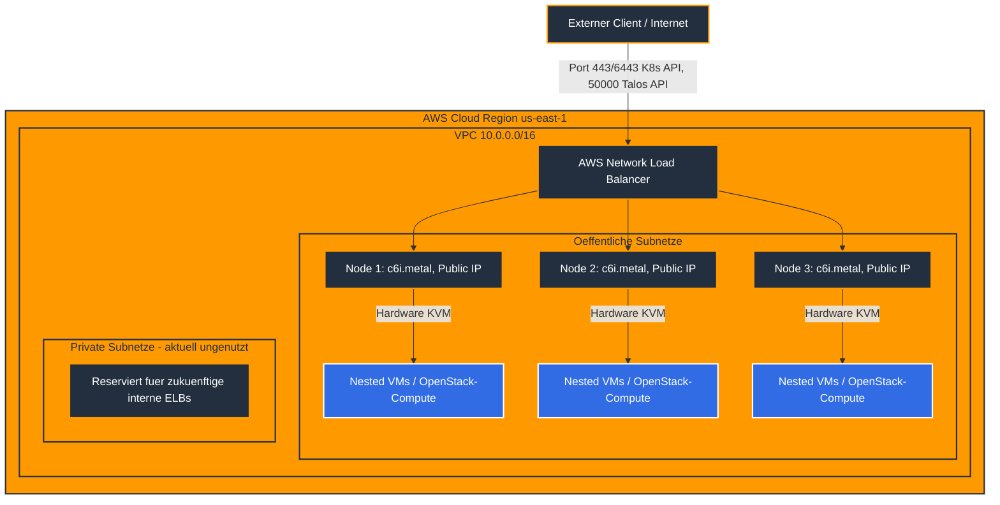

# README: Talos Linux auf AWS mit Nested Virtualization

### Projektübersicht
Dieses Repository enthält die deklarative Infrastruktur-als-Code-Definition zur Bereitstellung eines Talos-Linux-Clusters auf Amazon Web Services. Der technologische Kernfokus dieses Deployments liegt auf der Aktivierung der hardwarebeschleunigten verschachtelten Virtualisierung auf Kernel-Ebene, um darauf perspektivisch OpenStack (via Yaook) oder KubeVirt-Workloads zu betreiben. Die Orchestrierung wird durch Terraform gesteuert, wobei das Community-Modul [isovalent/terraform-aws-talos](https://github.com/isovalent/terraform-aws-talos) für Talos auf AWS zum Einsatz kommt. Dieses Modul abstrahiert den manuellen Bootstrapping-Prozess weitgehend und übersetzt die Talos-Konfiguration in AWS-Ressourcen — es installiert allerdings **kein CNI und keinen Cloud-Controller automatisch fertig konfiguriert**, siehe Abschnitt "Bereitstellung" unten.

> Dieses Setup ist ein Lern-/Experimentier-Projekt, kein produktionsreifes Referenzdesign. Die folgenden Abschnitte beschreiben bewusst auch die Ecken und Kanten, die beim Testen aufgefallen sind.

### Architektur
Die physische Grundlage des Clusters bilden dedizierte Bare-Metal-Instanzen der Klasse `c6i.metal`. Diese Architekturentscheidung ist zwingend erforderlich, da der AWS-Nitro-Hypervisor bei herkömmlichen virtualisierten EC2-Instanzen (Stand vor Februar 2026) die für Nested Virtualization nötigen VMX-CPU-Erweiterungen herausfiltert. Bare-Metal-Instanzen laufen ohne Hypervisor-Zwischenschicht, wodurch KVM-in-KVM garantiert mit Hardware-Beschleunigung statt Software-Emulation läuft. (Seit Februar 2026 unterstützt AWS Nested Virtualization inzwischen auch auf einigen virtualisierten Instanzfamilien wie `m8i`/`c8i`/`r8i`/`c7i`/`m7i`/`r7i` über die neue CPU-Option `cpu_options.nested_virtualization`. Das verwendete Terraform-Modul reicht diese Option aktuell aber nicht durch — siehe Befund 1 unten — weshalb hier bewusst bei Bare-Metal geblieben wird.)

Das Architekturdesign verzichtet bewusst auf dedizierte Worker-Knoten und nutzt stattdessen ein reines Control-Plane-Cluster (`worker_groups = []`), bestehend aus mehreren Knoten, welche durch `allow_workload_on_cp_nodes = true` als vollwertige Worker für Workloads autorisiert sind.

**Tatsächliche Netzwerktopologie (wichtig, weicht vom ursprünglichen Diagramm ab — siehe Befund 4):** Alle Talos-Knoten laufen in den **öffentlichen** Subnetzen mit **öffentlicher IP-Adresse**. Das ist keine Fehlkonfiguration, sondern eine dokumentierte Voraussetzung des `isovalent/terraform-aws-talos`-Moduls: Der Talos-Terraform-Provider spricht während Bootstrap und Configuration-Apply direkt über die öffentliche IP mit der Talos-API (Port 50000) jeder Instanz. Die privaten Subnetze werden aktuell von keiner Ressource genutzt (siehe Befund 5) und existieren nur als Grundlage für spätere interne Load Balancer.




### Bereitstellung (Schritt für Schritt)

1. **AWS-Authentifizierung**: über eine in `~/.aws/config` definierte `sso-session`, initialisiert via `aws sso login`.
2. **`terraform.tfvars` prüfen, bevor `terraform apply` läuft:**
   - `control_plane_count` ggf. auf `1` reduzieren, siehe Kostenhinweis unten.
   - **`external_source_cidrs` zwingend einschränken** (Standardwert ist `0.0.0.0/0` = Kubernetes- und Talos-API weltweit erreichbar, siehe Befund 6). Eigene IP ermitteln mit `curl -4 ifconfig.me` und als `"<IP>/32"` eintragen.
3. `terraform init && terraform apply`. Das Modul erzeugt VPC, NLB, Security Groups, die EC2-Instanzen, bootstrapped Talos und schreibt `talosconfig`/`kubeconfig` lokal unter `.terraform/.workspace-*/`.
4. **Cilium installieren (Pflichtschritt, siehe Befund 3):** Das Modul liefert absichtlich **kein CNI** aus (`network.cni.name = "none"`) und deaktiviert kube-proxy. Ohne diesen Schritt bleiben alle Nodes dauerhaft `NotReady`:
   ```bash
   ./scripts/install-cilium.sh
   ```
   Das Skript liest die kubeconfig über `terraform output -raw kubeconfig_pfad` und installiert Cilium mit den von Talos empfohlenen Einstellungen (kube-proxy-Replacement, KubePrism auf `localhost:7445`, IPAM-Modus `kubernetes`).
5. Zugriff einrichten:
   ```bash
   export KUBECONFIG=$(terraform output -raw kubeconfig_pfad)
   export TALOSCONFIG=$(terraform output -raw talosconfig_pfad)
   kubectl get nodes
   ```

### Bekannte Einschränkungen

- **Root-Volume fest auf 50 GB**: Das Modul hängt die Instanzgröße des Root-Volumes intern fest auf 50 GB, ohne Möglichkeit zur Konfiguration über Modul-Inputs. Für spätere OpenStack/Yaook-Workloads (Image-Storage, Cinder/Glance-Backends) reicht das voraussichtlich nicht aus — dafür separate EBS-Volumes einplanen oder das Modul forken.
- **Kein CNI, kein CCM per Default**: siehe Bereitstellungsschritt 4 und Befund 2/3.
- **Modul-Referenz gepinnt auf `v0.15.1`** (siehe Befund 7): bewusst kein `ref=main`, um reproduzierbare Deployments zu gewährleisten. Bei einem gewünschten Upgrade das Changelog des Moduls prüfen und den `ref`-Wert in `talos.tf` bewusst anheben.

### Kostenhinweis

`c6i.metal` kostet ca. **$5,44/h pro Node** (us-east-1, Stand 2026). Bei `control_plane_count = 3` sind das ca. **$16,32/h bzw. ~$11.760/Monat**, solange der Cluster läuft. Es gibt keine kleinere `.metal`-Variante innerhalb der `c6i`-Familie — Bare-Metal-Instanzen sind immer an der größten Größe der Familie gebunden. Für reine Tests `control_plane_count` auf `1` reduzieren und den Cluster nach der Session mit `terraform destroy` wieder abbauen.

### Häufig gestellte Fragen (FAQ)

**Warum werden Bare-Metal-Instanzen anstelle der m8i-Serie verwendet?**
Bare-Metal-Instanzen garantieren direkten Hardwarezugriff auf die VMX-CPU-Erweiterungen ohne weitere Konfiguration. AWS unterstützt seit Februar 2026 zwar auch Nested Virtualization auf virtualisierten `m8i`/`c8i`/`r8i`/`c7i`/`m7i`/`r7i`-Instanzen über `cpu_options.nested_virtualization = enabled` — das würde hier aber einen Fork des `isovalent/terraform-aws-talos`-Moduls erfordern, da dessen `control_plane`/`worker_groups`-Schnittstelle aktuell kein Durchreichen von `cpu_options` vorsieht (siehe Befund 1). Für dieses Setup wurde daher der einfachere, garantiert funktionierende Weg über Bare-Metal gewählt.

**Warum wird die `worker_groups`-Variable als leeres Array definiert?**
Um eine einfache Architektur zu etablieren, wird das Cluster ausschließlich aus Control-Plane-Knoten gebildet. Durch `allow_workload_on_cp_nodes = true` übernehmen diese Knoten die doppelte Rolle aus Cluster-Management und Workload-Verarbeitung, wodurch separate Worker-Instanzen entfallen. Das leere Array `[]` teilt dem Modul technisch korrekt mit, dass keine Worker-Provisionierung erwünscht ist.

**Welche Funktion erfüllt der AWS Load Balancer in diesem Setup?**
Die Talos-Knoten haben eigene öffentliche IP-Adressen (siehe Architektur-Abschnitt oben — **nicht** rein private Subnetze, wie ein früherer Stand dieses READMEs fälschlich behauptete). Der Network Load Balancer dient als stabiler, einzelner DNS-Endpunkt für Kubernetes- (6443/443) und Talos-API (50000) über alle Control-Plane-Knoten hinweg und übernimmt Health-Checks — er ist kein Sicherheitsgateway. Die eigentliche Zugriffsbeschränkung erfolgt ausschließlich über `external_source_cidrs` in den Security Groups (siehe Befund 6).

### Troubleshooting und Fehlerbehebung

**`wait-for-subnets.sh` hängt / Terraform-Deployment stoppt beim Talos-Modul:** Das Modul sucht Subnetze über die Tags `type=public` bzw. `type=private` (siehe `vpc.tf`, `public_subnet_tags`/`private_subnet_tags`). Fehlen diese Tags, findet die `aws_subnets`-Datenquelle nichts und das Skript wartet endlos.

**Nodes bleiben nach dem Start dauerhaft `NotReady`:** Meistens fehlt der Cilium-Installationsschritt (Bereitstellungsschritt 4, Befund 3) — ohne CNI kann kein Pod-Netzwerk aufgebaut werden, CoreDNS & Co. bleiben `Pending`. `enable_external_cloud_provider` und `deploy_external_cloud_provider_iam_policies` sind in `talos.tf` bereits standardmäßig aktiviert (Befund 2), sodass der AWS Cloud Controller Manager die nötigen IAM-Rechte hat.

