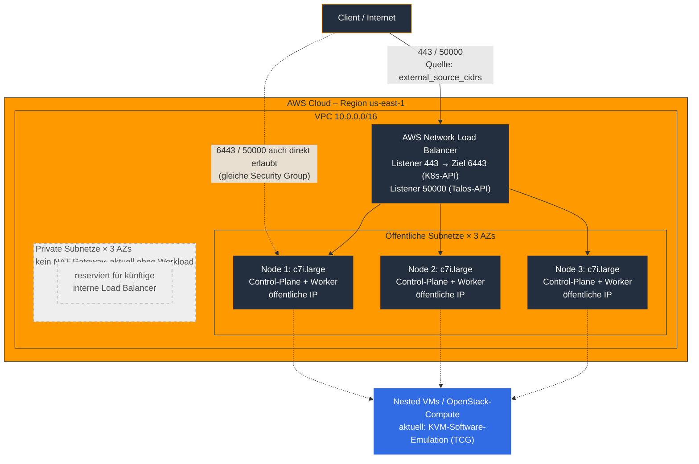

# Talos Linux auf AWS mit Nested Virtualization

**Repository:** [lanixx/talos-aws](https://github.com/lanixx/talos-aws)

## Inhaltsverzeichnis

1. [Überblick](#1-überblick)
2. [Architektur](#2-architektur)
3. [Bekannte Einschränkungen](#3-bekannte-einschränkungen)
4. [Voraussetzungen](#4-voraussetzungen)
5. [Deployment – Schritt für Schritt](#5-deployment--schritt-für-schritt)
6. [Konfigurationsreferenz](#6-konfigurationsreferenz)
7. [FAQ](#7-faq)
8. [Troubleshooting](#8-troubleshooting)
9. [Cluster-Abbau](#9-cluster-abbau)
10. [Weiterführende Links](#10-weiterführende-links)

---

## 1. Überblick

Dieses Repository stellt einen Talos-Linux-Kubernetes-Cluster auf AWS EC2 per Terraform bereit. Kernziel ist ein Cluster mit hardwarenaher verschachtelter Virtualisierung (nested virtualization) als Grundlage für spätere VM-Workloads – über KubeVirt oder als Basis für OpenStack via Yaook. Die Orchestrierung nutzt das Community-Modul [isovalent/terraform-aws-talos](https://github.com/isovalent/terraform-aws-talos), das den Bootstrapping-Prozess von Talos weitgehend automatisiert.

Das Setup ist ein Lern-/Experimentier-Projekt, kein produktionsreifes Referenzdesign. Es besteht aus einem reinen Control-Plane-Cluster (keine separaten Worker), das über eine Handvoll Terraform-Dateien und ein Installations-Skript für Cilium definiert ist.

| Datei | Zweck |
|---|---|
| `README.md` | Diese Dokumentation |
| `main.tf` | Terraform-/Provider-Versionen |
| `vpc.tf` | VPC mit öffentlichen und privaten Subnetzen über 3 Availability Zones |
| `talos.tf` | Einbindung des Isovalent-Moduls, Control-Plane-Definition |
| `kvm-patch.yaml` | Talos-Machine-Config-Patch: KVM-Kernel-Module, Worker-Label |
| `variables.tf` | Variablendeklarationen |
| `terraform.tfvars` | Konkrete Werte (Region, Instanztyp, CIDRs, …) |
| `outputs.tf` | Outputs für `kubeconfig` und `talosconfig` |
| `scripts/install-cilium.sh` | Installiert Cilium als CNI nach dem Bootstrap |

---

## 2. Architektur

Terraform provisioniert zunächst ein VPC mit drei öffentlichen und drei privaten Subnetzen (je eines pro Availability Zone). Die öffentlichen Subnetze sind mit dem Tag `type=public` versehen, die privaten mit `type=private` – dieses Tagging wird vom Isovalent-Modul aktiv ausgewertet, um seine Ressourcen zu platzieren.

**Alle Cluster-Knoten laufen in den öffentlichen Subnetzen mit öffentlicher IP-Adresse.** Das ist eine Vorgabe des zugrunde liegenden Terraform-Moduls: Der Talos-Provider spricht während Bootstrap und Konfiguration direkt über die öffentliche IP mit der Talos-API (Port 50000) jedes Knotens. Die privaten Subnetze tragen zwar die nötigen Tags, werden aktuell aber von keiner Ressource genutzt – sie dienen als Grundlage für spätere interne Load Balancer, falls Kubernetes-Services das benötigen. Ein NAT-Gateway ist deshalb bewusst nicht aktiviert.

Die Control-Plane-Knoten laufen auf virtualisierten Nitro-Instanzen der Klasse `c7i.large` – bewusst keine Bare-Metal-Instanz. Bare-Metal-Instanzen unterstützen auf AWS kein UEFI-Boot (nur Legacy BIOS), die offizielle Talos-AMI ist aber UEFI-basiert; ein `.metal`-Typ würde beim Instanzstart mit einem Boot-Mode-Fehler scheitern, bevor Nested Virtualization überhaupt zur Debatte steht. `c7i` wurde zusätzlich gezielt gewählt, weil die Familie zu den AWS-Instanztypen gehört, die grundsätzlich für die CPU-Option `cpu_options.nested_virtualization` vorgesehen sind (Details dazu in Abschnitt 3).

Ein Network Load Balancer (vom Isovalent-Modul erzeugt) dient als stabiler Endpunkt für Kubernetes-API (6443) und Talos-API (50000) über alle drei Control-Plane-Knoten hinweg. Das Cluster verzichtet auf dedizierte Worker-Knoten (`worker_groups = []`); durch Entfernen der Standard-Taints (`allow_workload_on_cp_nodes = true`) übernehmen die drei Control-Plane-Knoten zugleich die Worker-Rolle. Der AWS Cloud Controller Manager ist aktiviert (`enable_external_cloud_provider = true`, `deploy_external_cloud_provider_iam_policies = true`), wodurch Kubernetes die AWS-API für Node-Metadaten und künftige Load-Balancer-Provisionierung nutzen kann.



| Komponente | Herkunft | Rolle |
|---|---|---|
| VPC + Subnetze | `vpc.tf` | Netzwerkbasis; private Subnetze aktuell ungenutzt |
| Network Load Balancer | Isovalent-Modul | Endpoint für Kubernetes- und Talos-API |
| 3× EC2-Instanz `c7i.large` | Isovalent-Modul | Etcd, API-Server, Kubelet, KVM-Host |
| `kvm-patch.yaml` | dieses Repository | Kernel-Module `kvm`/`kvm_intel`, Worker-Label |
| AWS Cloud Controller Manager | Isovalent-Modul, aktiviert | Node-Metadaten, Grundlage für dynamische ELBs |
| `scripts/install-cilium.sh` | dieses Repository | CNI-Installation nach dem Bootstrap |
| `talosconfig` / `kubeconfig` | Terraform-Outputs | Administrativer Zugriff |

---

## 3. Bekannte Einschränkungen

**Keine Hardware-beschleunigte Nested Virtualization (aktuell).** `kvm-patch.yaml` lädt die Kernel-Module `kvm`/`kvm_intel` mit den Parametern `nested=1` und `ept=1`. AWS unterstützt inzwischen echte Hardware-Nested-Virtualization auch auf virtualisierten (Nicht-Metal-)Instanzen der Familien `c7i`/`m7i`/`r7i`/`c8i`/`m8i`/`r8i` – vorausgesetzt, beim Instanz-Start wird die CPU-Option `cpu_options.nested_virtualization = enabled` gesetzt. Das hier verwendete Terraform-Modul reicht diese Option für seine Control-Plane-Instanzen derzeit nicht durch (die Schnittstelle kennt nur `instance_type`, `config_patch_files` und `tags`). Ohne diese CPU-Option bleibt KVM auf Software-Emulation (TCG) beschränkt – funktional für erste Tests, aber spürbar langsamer als echte Hardware-Virtualisierung. Um das zu schließen, müsste das Modul um einen `cpu_options`-Block erweitert werden (Fork oder Upstream-Beitrag).

**Root-Volume fest auf 50 GB (gp3).** Der `control_plane`-Block des verwendeten Moduls unterstützt kein `root_block_device`-Attribut. Ein Versuch, die Root-Volume-Größe darüber zu setzen, wird von Terraforms Typsystem als nicht deklariertes Attribut abgelehnt (Validierungsfehler bei `terraform plan`, nicht stillschweigend ignoriert). Für größere Storage-Anforderungen – etwa Image-Storage für OpenStack/Yaook – empfiehlt sich vorerst ein zusätzliches, separates EBS-Volume statt eines vergrößerten Root-Volumes.

**Kein CNI vorinstalliert.** Die Kubernetes-Netzwerkkonfiguration ist bewusst auf `cni: none` gesetzt und kube-proxy deaktiviert, damit die CNI-Wahl offenbleibt. Ohne den in Abschnitt 5 beschriebenen manuellen Installationsschritt bleiben alle Knoten dauerhaft `NotReady`.

**Kubernetes- und Talos-API sind standardmäßig weltweit erreichbar.** Der Default-Wert für `external_source_cidrs` ist `0.0.0.0/0`. In Kombination mit den öffentlichen IP-Adressen der Knoten bedeutet das: Beide APIs sind ab dem ersten `terraform apply` aus dem gesamten Internet erreichbar, bis diese Variable eingeschränkt wird (siehe Abschnitt 5.3).

---

## 4. Voraussetzungen

**Lokale Werkzeuge:**

| Tool | Zweck |
|---|---|
| Terraform ≥ 1.5.0 | Infrastruktur-Provisionierung |
| `git` | Wird von `terraform init` benötigt, da das Talos-Modul per Git-URL referenziert wird |
| AWS CLI v2 | Authentifizierung |
| `talosctl` | Cluster-Administration ([Sidero Labs Releases](https://github.com/siderolabs/talos/releases)) |
| `kubectl` | Kubernetes-Administration |
| `helm` | Wird von `scripts/install-cilium.sh` vorausgesetzt |

**AWS-seitig:**

- Account mit Rechten für EC2, VPC, ELB/NLB und IAM-Policy-Erstellung (für den Cloud Controller Manager).
- Kenntnis der eigenen öffentlichen IP-Adresse für `external_source_cidrs`.
- Für `c7i.large` reichen die Standard-Service-Quotas in der Regel aus.

---

## 5. Deployment – Schritt für Schritt

### 5.1 AWS-Zugriff einrichten

```bash
aws sso login --profile <dein-sso-profil>
export AWS_PROFILE=<dein-sso-profil>
```

### 5.2 Repository klonen

```bash
git clone https://github.com/lanixx/talos-aws.git
cd talos-aws
```

### 5.3 `terraform.tfvars` prüfen

Vor dem ersten `apply` die eigene IP ermitteln und `external_source_cidrs` entsprechend einschränken:

```bash
curl -4 ifconfig.me
```

Rückgabewert als `"<deine-IP>/32"` eintragen. **Ohne diesen Schritt bleibt die Kubernetes- und Talos-API weltweit erreichbar** (siehe Abschnitt 3). Für Kurztests kann `control_plane_count` auf `1` reduziert werden, um Kosten zu sparen.

### 5.4 Terraform initialisieren und ausführen

```bash
terraform init
terraform plan
terraform apply
```

Das Deployment dauert erfahrungsgemäß mehrere Minuten: VPC- und Load-Balancer-Erstellung, Warten auf getaggte Subnetze, AMI-Boot und Talos-Bootstrap (etcd-Initialisierung) laufen sequenziell.

### 5.5 Zugangsdaten extrahieren

```bash
terraform output -raw kubeconfig  > kubeconfig
terraform output -raw talosconfig > talosconfig

export KUBECONFIG="$(pwd)/kubeconfig"
export TALOSCONFIG="$(pwd)/talosconfig"
```

### 5.6 Basis-Status prüfen

```bash
talosctl version
kubectl get nodes -o wide
```

Ein `NotReady`-Status aller Knoten ist an dieser Stelle normal und erwartet (siehe Abschnitt 3) – noch kein Fehler.

### 5.7 CNI installieren

```bash
./scripts/install-cilium.sh
```

Das Skript zieht die Zugangsdaten selbst über `terraform output`, installiert Cilium per Helm mit den für Talos passenden Werten (u. a. `kubeProxyReplacement=true`, KubePrism auf `localhost:7445`) und wartet anschließend bis zu 5 Minuten auf bereite Knoten.

### 5.8 Ergebnis prüfen

```bash
kubectl get nodes -o wide
kubectl get pods -A
```

Alle drei Knoten sollten jetzt `Ready` sein. Für den eigentlichen VM-Workload-Anwendungsfall ist ein zusätzlicher Operator nötig – KubeVirt (`kubectl apply -f https://github.com/kubevirt/kubevirt/releases/…/kubevirt-operator.yaml`) oder Yaook für OpenStack; beides ist nicht Teil dieses Repositories.

---

## 6. Konfigurationsreferenz

| Variable | Wert | Hinweis |
|---|---|---|
| `aws_region` | `us-east-1` | |
| `cluster_name` | `talos-kvm-cluster` | |
| `talos_version` | `v1.12.9` | |
| `kubernetes_version` | `1.33.1` | |
| `control_plane_instance_type` | `c7i.large` | Siehe Abschnitt 2/3 zur Instanztyp-Wahl |
| `control_plane_count` | `3` | Für Kurztests auf `1` reduzierbar |
| `vpc_cidr` | `10.0.0.0/16` | |
| `vpc_availability_zones` | `us-east-1a`, `us-east-1b`, `us-east-1c` | |
| `vpc_public_subnets` | `10.0.1.0/24`–`10.0.3.0/24` | Hier laufen alle Knoten |
| `vpc_private_subnets` | `10.0.11.0/24`–`10.0.13.0/24` | Ohne NAT-Gateway, aktuell ungenutzt |
| `external_source_cidrs` | `["0.0.0.0/0"]` | **Vor Nutzung einschränken (Abschnitt 5.3)** |
| `enable_external_cloud_provider` | `true` | Aktiviert den AWS Cloud Controller Manager |
| `deploy_external_cloud_provider_iam_policies` | `true` | Nötige IAM-Policies dafür |
| Root-Volume | 50 GB, gp3 (Modul-Default) | Nicht konfigurierbar, siehe Abschnitt 3 |

**Kostenrichtwert** (On-Demand, us-east-1, ohne Gewähr – aktuelle Preise auf [aws.amazon.com/ec2/pricing](https://aws.amazon.com/ec2/pricing/on-demand/) prüfen): `c7i.large` liegt bei ca. **$0,09/Std.** pro Knoten, bei drei durchgehend laufenden Knoten also ca. **$195/Monat**. Nicht vergessen: `terraform destroy` nach jedem Test (Abschnitt 9).

---

## 7. FAQ

**Warum keine Bare-Metal-Instanz, wenn es doch um Nested Virtualization geht?**
Bare-Metal-Instanzen unterstützen auf AWS kein UEFI-Boot, die offizielle Talos-AMI setzt aber UEFI voraus – der Instanzstart würde bereits an einem Boot-Mode-Fehler scheitern, bevor Nested Virtualization überhaupt relevant wird. `c7i.large` unterstützt UEFI und gehört zusätzlich zu den Instanzfamilien, die AWS grundsätzlich für die CPU-Option `cpu_options.nested_virtualization` vorsieht – auch wenn diese Option aktuell noch nicht durchgereicht wird (Abschnitt 3).

**Warum ist `worker_groups` ein leeres Array?**
Damit das Cluster ausschließlich aus den drei Control-Plane-Knoten besteht. `allow_workload_on_cp_nodes = true` entfernt die Standard-Taints, wodurch diese Knoten zugleich als Worker fungieren; separate, zusätzliche Instanzen entfallen dadurch.

**Welche Funktion hat der Load Balancer?**
Er ist ein für Kubernetes-API (6443) und Talos-API (50000) zuständiger Network Load Balancer – ein stabiler, gemeinsamer Endpunkt über alle Control-Plane-Knoten, kein Sicherheitsgateway. Die Knoten haben ohnehin eigene öffentliche IP-Adressen; die eigentliche Zugriffsbeschränkung erfolgt über `external_source_cidrs`.

**Ist der AWS Cloud Controller Manager aktiv?**
Ja, `enable_external_cloud_provider` und `deploy_external_cloud_provider_iam_policies` sind beide gesetzt.

**Muss ich ein CNI manuell installieren?**
Ja, per `./scripts/install-cilium.sh` nach dem ersten erfolgreichen `terraform apply` (Abschnitt 5.7).

**Was kostet ein Test-Deployment ungefähr?**
Rund $195/Monat bei durchgehendem Betrieb aller drei Knoten (Abschnitt 6) – deutlich abhängig davon, wie lange der Cluster tatsächlich läuft.

**Gibt es eine Lizenz für dieses Repository?**
Das Repository enthält keine `LICENSE`-Datei.

---

## 8. Troubleshooting

**`terraform apply` scheitert mit einem Boot-Mode-/UEFI-Fehler**
Tritt auf, wenn `control_plane_instance_type` auf einen `.metal`-Typ geändert wird. Bare-Metal-Instanzen unterstützen kein UEFI, die Talos-AMI aber schon (siehe Abschnitt 2/3). Bei einem virtualisierten Typ wie `c7i.large` bleibend.

**`terraform apply` hängt beim Warten auf Subnetze**
Das zugrunde liegende Modul wartet auf drei Subnetze mit dem Tag `type=public` in der VPC. Ursache ist praktisch immer ein Tagging-Problem in `vpc.tf`. Prüfen mit:

```bash
aws ec2 describe-subnets --filters Name=vpc-id,Values=<vpc-id> Name=tag:type,Values=public
```

**Knoten bleiben nach dem Start dauerhaft `NotReady`**
In den meisten Fällen fehlt der CNI-Installationsschritt – `./scripts/install-cilium.sh` ausführen (Abschnitt 5.7). `kubectl describe node <node>` zeigt in diesem Fall typischerweise eine Bedingung wie `NetworkPluginNotReady`.

**`install-cilium.sh` bricht mit „helm ist nicht installiert" ab**
`helm` lokal installieren: [helm.sh/docs/intro/install](https://helm.sh/docs/intro/install/).

**`terraform output -raw kubeconfig_pfad` oder `talosconfig_pfad` liefert einen Fehler**
Diese Outputs existieren nicht. Für den Zugriff auf die Zugangsdaten `terraform output -raw kubeconfig` bzw. `terraform output -raw talosconfig` verwenden (liefert den Rohinhalt, keinen Dateipfad) und wie in Abschnitt 5.5 beschrieben in eine Datei umleiten.

**Terraform-Validierungsfehler zu `config_patches`**
Das Modul verwaltet Cluster-Rollen autonom. Referenzierte Patch-Dateien dürfen deshalb keine Scheduling-Parameter auf Cluster-Ebene enthalten, sondern müssen sich auf den `machine`-Block beschränken – wie in `kvm-patch.yaml` bereits umgesetzt (Kernel-Module, `nested=1`/`ept=1`, Worker-Label).

**Terraform-Validierungsfehler beim Setzen von `root_block_device`**
Der `control_plane`-Block dieses Moduls kennt dieses Attribut nicht (nur `instance_type`, `config_patch_files`, `tags`). Für eine größere Root-Disk ist aktuell kein direkter Weg über dieses Modul vorgesehen (siehe Abschnitt 3).

**`terraform destroy` bleibt hängen bzw. die VPC lässt sich nicht löschen**
Wurden Kubernetes-Services vom Typ `LoadBalancer` angelegt, erzeugt der Cloud Controller Manager dafür ELBs außerhalb des Terraform-States. Vor `terraform destroy` alle solchen Services löschen und kurz warten, bis AWS die zugehörigen Load Balancer entfernt hat:

```bash
kubectl get svc -A | grep LoadBalancer
kubectl delete svc <name> -n <namespace>
```

---

## 9. Cluster-Abbau

```bash
# Vorher: alle Kubernetes-Services vom Typ LoadBalancer löschen
kubectl get svc -A | grep LoadBalancer
kubectl delete svc <name> -n <namespace>

terraform destroy
```

Im Anschluss über die AWS-Konsole prüfen (EC2-Instanzen, NLB, EIPs), ob alle kostenpflichtigen Ressourcen tatsächlich entfernt wurden.

---

## 10. Weiterführende Links

- Repository: [github.com/lanixx/talos-aws](https://github.com/lanixx/talos-aws)
- Zugrunde liegendes Terraform-Modul: [github.com/isovalent/terraform-aws-talos](https://github.com/isovalent/terraform-aws-talos)
- AWS – Boot-Modi von Instanztypen: [docs.aws.amazon.com/AWSEC2/latest/UserGuide/instance-type-boot-mode.html](https://docs.aws.amazon.com/AWSEC2/latest/UserGuide/instance-type-boot-mode.html)
- AWS – Nested Virtualization auf virtualisierten Instanzen: [docs.aws.amazon.com/AWSEC2/latest/UserGuide/amazon-ec2-nested-virtualization.html](https://docs.aws.amazon.com/AWSEC2/latest/UserGuide/amazon-ec2-nested-virtualization.html)
- Talos + Cilium: [docs.siderolabs.com/kubernetes-guides/cni/deploying-cilium](https://docs.siderolabs.com/kubernetes-guides/cni/deploying-cilium)
- KubeVirt: [kubevirt.io](https://kubevirt.io/)
- AWS EC2 On-Demand-Preise: [aws.amazon.com/ec2/pricing/on-demand](https://aws.amazon.com/ec2/pricing/on-demand/)